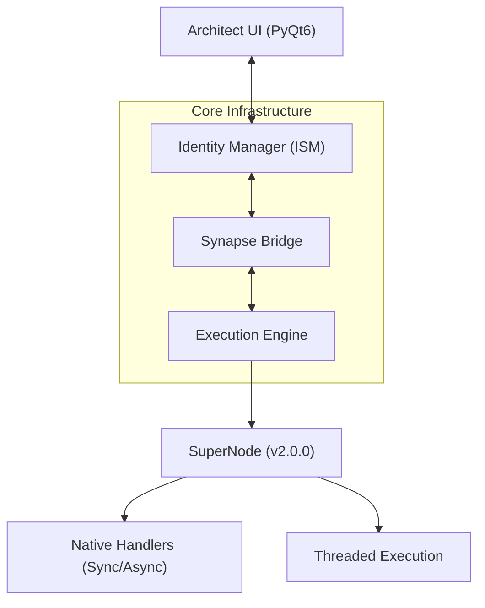

# Synapse VS (SVS) - Project Overview

**Synapse VS** is a high-performance visual scripting platform designed for secure automation, multi-tenant connectivity, and seamless AI orchestration. It allows developers to build complex, context-aware workflows through an intuitive node-based interface.

---

## 🏗️ System Architecture

SVS utilizes a **Hybrid Execution Model** where the UI and Engine are decoupled via a high-speed IPC bridge. The core logic is built upon the **SuperNode v2.0.0** architecture.



### 1. SuperNode Architecture (v2.0.0)

The standard base class for all nodes (`synapse/core/super_node.py`).

- **Strict Typing**: Inputs and Outputs are defined via `define_schema()` using `DataType` enums.
- **Event-Driven**: Logic is triggered via `register_handler("Flow", self.callback)` rather than overriding `execute()`.
- **Async & Threading**: Native support for asynchronous handlers and threaded execution loops.

### 2. The Bridge (synapse/core/bridge.py)

A Zero-Copy Shared Memory layer for real-time IPC.

- **Variable Vault**: Thread-safe storage for all graph variables.
- **Local Mirroring**: Caches frequently accessed data to minimize lock contention.

---

## 🧩 Node Development Standards

### Documentation (DocStrings)

All nodes must have a DocString to populate the UI Tooltips and Auto-Documentation. We adhere to three tiers of documentation:

#### 1. Full Format (Recommended)

Used for complex nodes. Must include a description followed by `### Inputs:` and `### Outputs:` lists.

```python
"""
Calculates the distance between two points.

### Inputs:
- Flow (flow): Triggers the calculation.
- Point A (vector): Starting position.
- Point B (vector): Target position.

### Outputs:
- Flow (flow): Continues execution.
- Distance (number): The calculated distance.
"""
```

#### 2. Partial Format

Used for legacy or internal nodes. detailed description but lacks structured I/O lists.
*Example: Add Node, CSV Query.*

#### 3. Single-Line Format

Used for simple, self-explanatory nodes.
*Example: "Compares two values and branches based on the result."*

### Schema Definition

Nodes must define their interface in `define_schema`.

```python
def define_schema(self):
    self.input_schema = {
        "Flow": DataType.FLOW,
        "Input Name": DataType.STRING
    }
    self.output_schema = {
        "Flow": DataType.FLOW,
        "Result": DataType.BOOLEAN
    }
```

---

## 📦 Core Modules Breakdown

| Directory | Component | Purpose |
| :--- | :--- | :--- |
| `synapse/core/` | **Core** | Engine, Bridge, SuperNode, Loader. |
| `synapse/gui/` | **Interface** | PyQt6 node canvas, Miniworld, Property panels. |
| `synapse/nodes/` | **Library** | Native node implementations (Standard Lib, Media, Network). |
| `synapse/models/` | **Data** | Data classes and state management. |
| `plugins/` | **Plugins** | Reusable `.syp` and `.spy` extensions. |

---

## 🚀 Key Features

- **Identity-Aware SCIA**: Protocol-agnostic auth (REST, gRPC, WSS) handling multi-tenancy automatically.
- **Universal LLM Integration**: Single-prompt orchestration for OpenAI, Gemini, and Ollama.
- **Hot Package Manager**: On-demand dependency installation (`DependencyManager`).
- **Detached Graph Telemetry**: Standalone Minimap windows that persist outside the main window's OS grouping for dual-monitor debugging.
- **Magic Discovery Engine**: Smart element resolution with recursive iframe traversal and absolute XPath support.
- **Robust Browser Actions**: surgical click/wait fallbacks (forced and coordinate-based) for high-reliability web automation.

---

## 📚 Documents

The project maintains a structured documentation hierarchy to support developers and power users:

### 📖 System Documentation

- **[Installation Guide](file:///f:/My%20Programs/Synapse%20VS/docs/Installing.md)**: Hardware requirements and platform setup.
- **[Developer Guide](file:///f:/My%20Programs/Synapse%20VS/docs/developer.md)**: Deep dive into SuperNode architecture, lifecycle, and core internals.
- **[PowerUser Guide](file:///f:/My%20Programs/Synapse%20VS/docs/PowerUser.md)**: Advanced scripting and workflow optimization techniques.

### 🧩 Node Reference

- The **[docs/nodes/](file:///f:/My%20Programs/Synapse%20VS/docs/nodes/)** directory contains auto-generated documentation for the entire standard library.
- Each node class's `DocString` is used to populate interactive tooltips within the **Architect UI**.

---

---

> [!TIP]
> Refer to `synapse/nodes/lib/` for examples of v2.0.0 SuperNodes.
