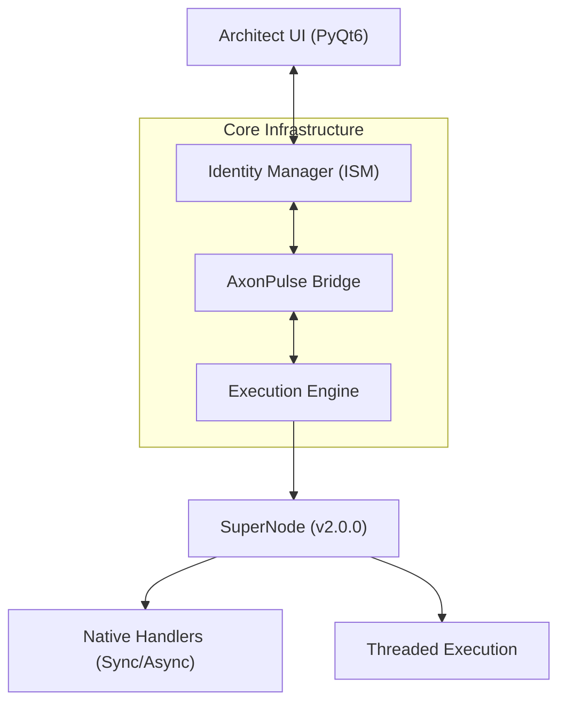

# AxonPulse VS (SVS) - Project Overview

**AxonPulse VS** is a high-performance visual scripting platform designed for secure automation, multi-tenant connectivity, and seamless AI orchestration. It allows developers to build complex, context-aware workflows through an intuitive node-based interface.

---

## 🏗️ System Architecture

SVS utilizes a **Hybrid Execution Model** where the UI and Engine are decoupled via a high-speed IPC bridge. The core logic is built upon the **SuperNode v2.0.0** architecture.


```mermaid
graph TD
    UI["Architect UI (PyQt6)"] <--> ISM["Identity Manager (ISM)"]
    ISM <--> Bridge["AxonPulse Bridge"]
    Bridge <--> Engine["Execution Engine"]
    
    Engine --> SuperNode["SuperNode (v2.0.0)"]
    SuperNode --> Native["Native Handlers (Sync/Async)"]
    SuperNode --> Threaded["Threaded Execution"]
    
    subgraph "Core Infrastructure"
        Bridge
        Engine
        ISM
    end
```

### 1. SuperNode Architecture (v2.0.0)

The standard base class for all nodes (`axonpulse/core/super_node.py`).

- **Strict Typing**: Inputs and Outputs are defined via `define_schema()` using `DataType` enums.
- **Event-Driven**: Logic is triggered via `register_handler("Flow", self.callback)` rather than overriding `execute()`.
- **Async & Threading**: Native support for asynchronous handlers and threaded execution loops.
- **Defensive Data Resolution (v2.1.0)**: Automatically falls back to static node properties if expected wired inputs are missing.

### 2. The Bridge (axonpulse/core/bridge.py)

A Zero-Copy Shared Memory layer for real-time IPC.

- **Variable Vault**: Thread-safe storage for all graph variables.
- **Local Mirroring**: Caches frequently accessed data to minimize lock contention.

### 3. Asset Packaging Ecosystem

SVS supports secure distribution of logic via standardized `.zip` packages.

- **Interactive Auth**: Encrypted zips prompt the user for passwords via the UI bridge.
- **Automated Extraction**: Packages are safely extracted to `plugins/extracted/` with dependency shielding.
- **Hot-Loading**: Contents (nodes and subgraphs) are instantly registered into the active library upon successful authentication.

---

## 🧩 Node Development Standards

### Documentation (DocStrings)

All nodes must have a DocString to populate the UI Tooltips and Auto-Documentation. We adhere to three tiers of documentation:

#### 1. Full Format (Recommended)

Used for complex nodes. Must include a description followed by `### Inputs:` and `### Outputs:` lists.

```python
"""
Calculates the distance between two points.

### Inputs:
- Flow (flow): Triggers the calculation.
- Point A (vector): Starting position.
- Point B (vector): Target position.

### Outputs:
- Flow (flow): Continues execution.
- Distance (number): The calculated distance.
"""
```

#### 2. Partial Format

Used for legacy or internal nodes. detailed description but lacks structured I/O lists.
*Example: Add Node, CSV Query.*

#### 3. Single-Line Format

Used for simple, self-explanatory nodes.
*Example: "Compares two values and branches based on the result."*

### Schema Definition

### Schema Definition

Nodes must define their interface in `define_schema`.

```python
def define_schema(self):
    self.input_schema = {
        "Flow": DataType.FLOW,
        "Input Name": DataType.STRING
    }
    self.output_schema = {
        "Flow": DataType.FLOW,
        "Result": DataType.BOOLEAN
    }
```

---

## 📦 Core Modules Breakdown

| Directory | Component | Purpose |
| :--- | :--- | :--- |
| `axonpulse/core/` | **Core** | Engine, Bridge, SuperNode, Loader. |
| `axonpulse/gui/` | **Interface** | PyQt6 node canvas, Miniworld, Property panels. |
| `axonpulse/nodes/` | **Library** | Native node implementations (Standard Lib, Media, Network). |
| `axonpulse/models/` | **Data** | Data classes and state management. |
| `plugins/` | **Plugins** | Reusable `.syp` and `.spy` extensions. |

---

## 🚀 Key Features

- **Identity-Aware SCIA**: Protocol-agnostic auth (REST, gRPC, WSS) handling multi-tenancy automatically.
- **Universal LLM Integration**: Single-prompt orchestration for OpenAI, Gemini, and Ollama.
- **Hot Package Manager**: On-demand dependency installation (`DependencyManager`).
- **Detached Graph Telemetry**: Standalone Minimap windows that persist outside the main window's OS grouping for dual-monitor debugging.
- **Magic Discovery Engine**: Smart element resolution with recursive iframe traversal and absolute XPath support.
- **Robust Browser Actions**: surgical click/wait fallbacks (forced and coordinate-based) for high-reliability web automation.
- **SubGraph File Rescue**: Automatic fallback to embedded `.syp` cache when dynamic graph targets are moved or deleted, with UI recovery hooks.
- **Headless Execution Profiling**: Strictly gated backend parsing allows graphs to sprint down to `0.0s` logical tick rates without blocking the PyQt main thread.
- **Node Library Tuning**: Toggleable DocStrings and instantaneous search filtering for a streamlined authoring experience.
- **Canvas Rendering: Viewport Culling**: Your approach to only drawing visible nodes (with a slight buffer margin for smooth panning) is exactly the right path. In PyQt6, the QGraphicsScene relies heavily on bounding rects. By explicitly telling the canvas to suspend complex paint operations (like drop shadows, antialiasing on thick wires, or live text updates) when a node's bounding box intersects outside the visible viewport, you can keep the framerate locked at 60 FPS even with thousands of nodes. It is highly effective and requires far less overhead than writing custom OpenGL shaders.

---

## 📚 Documents

The project maintains a structured documentation hierarchy to support developers and power users:

### 📖 System Documentation

- **[Installation Guide](file:///f:/My%20Programs/AxonPulse%20VS/docs/Installing.md)**: Hardware requirements and platform setup.
- **[Developer Guide](file:///f:/My%20Programs/AxonPulse%20VS/docs/developer.md)**: Deep dive into SuperNode architecture, lifecycle, and core internals.
- **[PowerUser Guide](file:///f:/My%20Programs/AxonPulse%20VS/docs/PowerUser.md)**: Advanced scripting and workflow optimization techniques.

### 🧩 Node Reference

- The **[docs/nodes/](file:///f:/My%20Programs/AxonPulse%20VS/docs/nodes/)** directory contains auto-generated documentation for the entire standard library.
- Each node class's `DocString` is used to populate interactive tooltips within the **Architect UI**.

---

---

> [!TIP]
> Refer to `axonpulse/nodes/lib/` for examples of v2.0.0 SuperNodes.
