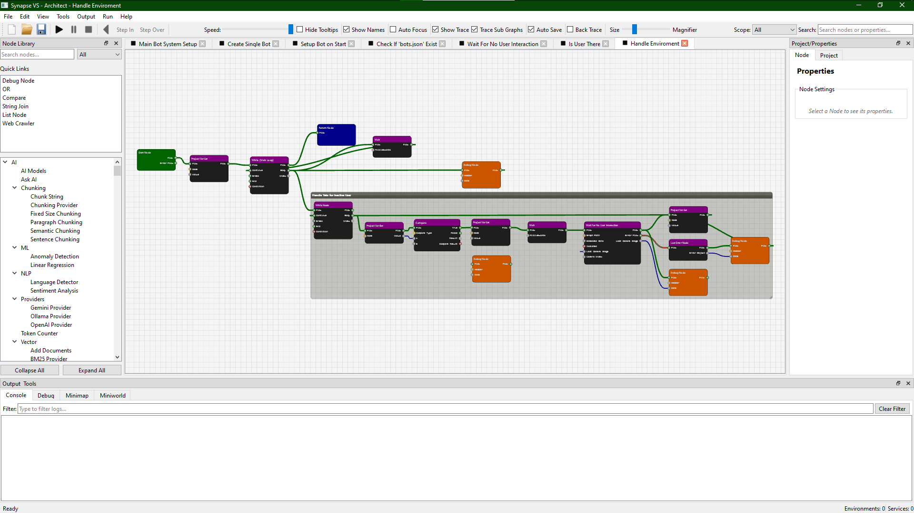
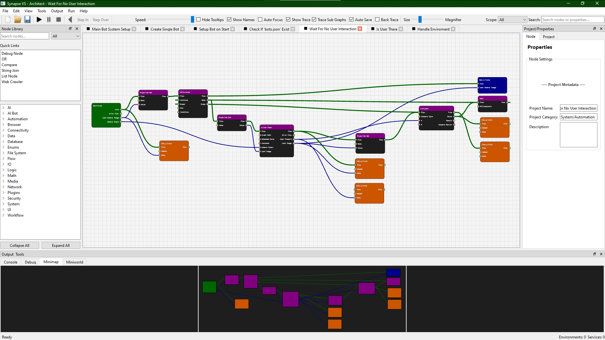
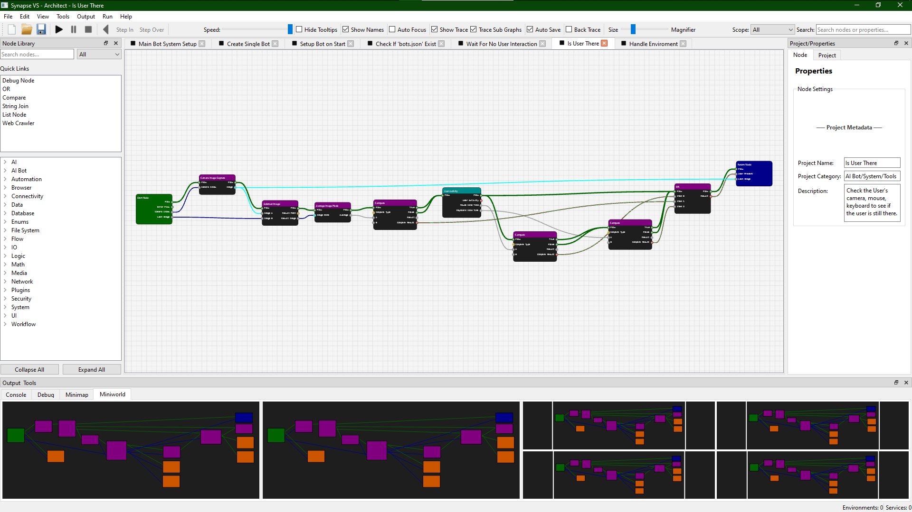

# Synapse VS (SVS) - Visual Scripting

**Synapse VS (Visual Script)** is a powerful, node-based automation and data processing platform. It allows users to build complex workflows using a visual interface, combining AI, system operations, and data transformations into cohesive "graphs".

## 🚀 Key Features

* **Hot Packages**: Optional dependencies are installed on-demand — the first time you use a node that needs an extra library, SVS prompts you to install it automatically. No manual `pip install` needed.
* **Secure API Management**: Pass API keys dynamically via input ports or securely fetch them from OS **Environment Variables**.
* **Dynamic Subgraphs**: Build reusable tools and "favorited" subgraphs with full property propagation from parent nodes.
* **Architect UI**:
  * **Miniworld & Layout**: Asymmetric layout with 2 large and 4 small viewports. Slots track "Offline/Disconnected" graphs and must be manually assigned via right-click context menu.
  * **Deep Search**: Top-right search box scans Node Names, Types, and *Properties* (e.g., URLs). Press Enter to cycle logically through matches with a "pulse" animation.
  * **Visual Feedback**:
    * **Purple Highlight**: Running Native Service (e.g., Flask).
    * **Green Border**: Active SubGraph execution.
    * **Kinetic Fading**: Wires fade out over 1 second to trace execution paths.
  * **Smart Features**:
    * **Hot-Reloading**: Auto-updates subgraphs when files change.
    * **Auto-Save**: Triggers 3 seconds after metadata changes.
    * **Session Restore**: Reopens previous tabs, layout, and viewports on launch.
* **Extensible Plugin System**: Easily add new nodes and providers in Python.

## 🖼️ Visual Overview

### The Architect UI

The **Architect** is the primary workspace for building and debugging graphs. It consists of several key areas:

* **Toolbar**: Quick access to File operations (New, Open, Save), Execution controls (Run, Pause, Step, Stop), and UI toggles like the Speed Slider and Magnifier.
* **Node Library (Quick Links)**: A searchable catalog of all available nodes, organized by category.
* **Properties & Project Panel**: Configure settings for the selected node or manage global project metadata.
* **Console Panel**: Displays real-time logs and standard output from your running nodes.
* **Debug Panel**: Precise inspection of data flow, variable states, and error messages.

### Minimap Navigation

The **Minimap** provides a high-level bird's-eye view of your entire graph. It allows for rapid navigation through large, complex logic flows by clicking or dragging the view rectangle. It also visualizes active node execution "pulses" in real-time.

### Miniworld: Mission Control

The **Miniworld** is a unique multi-viewport system that allows you to monitor up to 6 different graphs or subgraph instances simultaneously. Each slot provides a live preview of execution, making it the central "mission control" for complex, interconnected automation systems.

## 🚀 Getting Started

### 1. Installation

1. **Clone the Repo**: `git clone https://github.com/Antigravity-Team/SynapseVS.git`
2. **Run**: Double-click `synapse.bat` (Windows) or run `python synapse.py` (Linux/Mac).
    * *Note: First run will prompt you to choose between **Minimal** (online hot-loading) or **Full** (offline capable) installation.*

### 2. Hello World

Let's build your first graph:

1. **Create New Graph**: Click `File -> New Graph`.
2. **Add Nodes**:
    * Right-click the canvas to open the context menu.
    * Search for **Start** and add it. (Required for every graph)
    * Search for **Toast Notification** (under GUI) and add it.
    * Search for **Return** and add it. (Ends the execution)
3. **Connect Flow**:
    * Drag a wire from **Start**'s "im" (Flow) port to **Toast Notification**'s "im" port.
    * Drag a wire from **Toast Notification**'s "out" port to **Return**'s "im" port.
4. **Configure Properties**:
    * Click the **Toast Notification** node.
    * In the **Properties Panel** (right side), set the "Message" property to `"Hello World"`.
5. **Run**: Press **F5** or click the Play button (▶). You should see a Windows notification pop up!
    * *Tip: Use the **Speed Slider** in the toolbar to slow down execution and watch the flow move node-to-node.*

### 3. Build Your Logic

1. **Open or Create a Graph**: Start with a new graph or open an existing `.syp` file.
2. **Build Your Logic**: Drag nodes from the Library, wire them together, and configure their properties.
3. **Execute**: Hit **F5** or the Play button to run your graph and observe real-time flow highlights.

## 📖 Documentation

For detailed guides, check the `docs/` folder:

* [Getting Started](docs/Installing.md) - Install and launch SVS.
* [How to Use](docs/UI_Usage.md) - Learn the Architect interface.
* [Node Reference](docs/nodes/Index.md) - Complete guide to available nodes.

* [Power User Guide](docs/PowerUser.md) - Advanced tips, tricks, and example graphs.
* [Developer Guide](docs/developer.md) - Technical breakdown for backend and extensions.

## 💬 Community

* [Discussion Board](https://github.com/ComputerAces/Synapse-VS/discussions) - Ask questions, share ideas, and get help from the community.

## ⚖️ License

SVS Alpha is provided for **single use** only. For commercial use inquiries, please email **<compaces79@gmail.com>**.

See [License](license.md) for full details.
